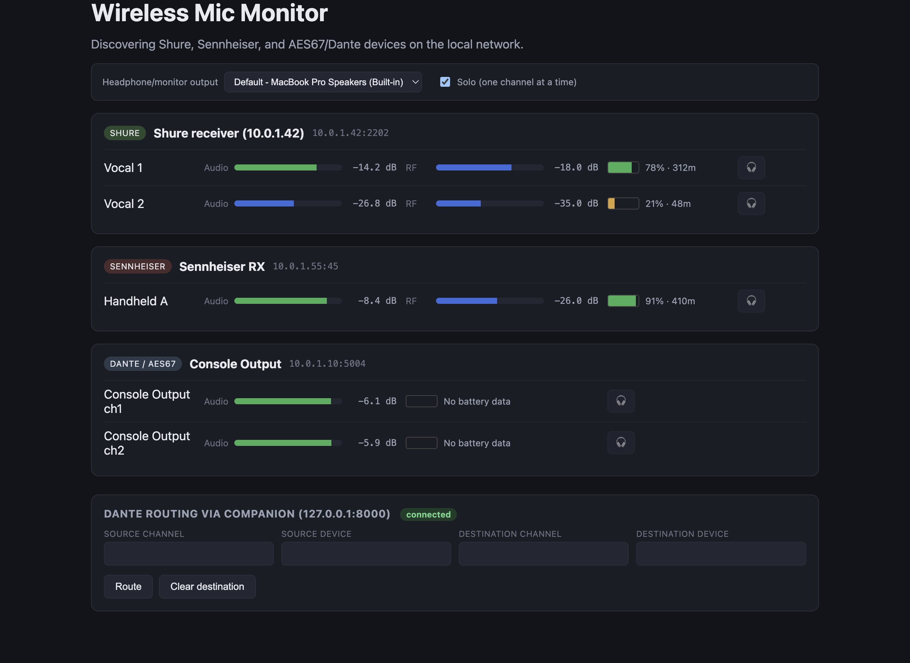

# MicWizard user guide

Discovering Shure and Sennheiser wireless receivers on the network, watching their battery and
RF, monitoring audio, and triggering Dante routes through your own Companion.

---

## Two things before anything else
### There is a successor

**[RFutils](https://github.com/stoatworks-labs/RFutils)** merged MicWizard, `wsm-wwb-bridge` and
`pmse-to-wwb` into one suite, and MicWizard's functionality lives there as the **Monitor** tab.
If you're choosing a tool rather than maintaining this one, start there.

### None of this has been tested against real wireless hardware

The README's [Protocol status](../README.md#protocol-status) table is the authority, and it is
honest. Summarised:

| | Discovery | Metering | Trust it? |
|---|---|---|---|
| **Dante / AES67** | verified against **real** Dante gear | verified end-to-end against a **synthetic** sender | The decode is proven correct against traffic that was hand-crafted. Real senders can still differ — L24, odd frame sizes, jitter, SDP variation. |
| **Shure** | TCP scan, port 2202 | protocol is **documented** by Shure | **Never tested against a real receiver.** |
| **Sennheiser** | mDNS `_ssc._tcp` — real | **speculative** | The metering paths are **best-effort guesses**. Expect them to be wrong. |

**Don't rely on this for a live show** without validating against your own hardware first. If you
*have* real gear, [`data-captures.md`](data-captures.md) explains exactly what capture would help
— it's simpler than it sounds, no special network gear or bridging needed.

---

## The window

*The two features this guide keeps separating are both visible here: the 🎧 button on each
channel row, and the **Dante routing via Companion** panel at the bottom. They sit near each
other and have nothing to do with each other.*

The output selector and **Solo (one channel at a time)** at the top govern the headphone button
only — see [Local monitoring](#local-monitoring--the-headphone-button).

---

## Finding receivers
**Shure** — MicWizard scans the subnet on **TCP 2202**. A host only appears once a real protocol
handshake succeeds, so an unrelated device with that port open won't show up as a receiver.
Because it's a scan rather than a broadcast, receivers on a different subnet won't be found.

**Sennheiser** — discovered over mDNS (`_ssc._tcp`). This part is real. What follows discovery —
the battery, RF and audio readings — is the speculative part ([Two things before anything else](#two-things-before-anything-else)).

**Dante / AES67 sources** — found from **SAP announcements**, which is how AES67 streams
advertise themselves. Nothing appears unless AES67 is actually enabled on the Dante network; a
Dante-only flow is invisible to this.

---

## Local monitoring — the headphone button
Every channel has a 🎧 button. **This is entirely local.** It plays that channel out of whichever
output you've picked above the device list — built-in speakers, a headphone interface, a
Bluetooth speaker.

**It has nothing to do with the network audio matrix or the Companion routing feature.** Clicking
it changes nothing on the Dante network and nobody else hears anything change. It also works for
analog-only receivers patched into a USB interface.

If you take one thing from this guide: **the 🎧 button and the routing panel are two unrelated
features that happen to sit near each other.**

---

## Dante routing — it presses your Companion's buttons
**MicWizard does no routing itself, deliberately.** It drives *your* Bitfocus Companion instance,
so the routing logic stays in the tool you already trust with it.

How it works: MicWizard sets Companion **variables** describing the crosspoint it wants, then
**presses one of two buttons you configure** — "make crosspoint" and "clear crosspoint". Your
buttons read those variables and perform the route.

### You have to build the Companion side

Copy `companion-routes.example.json` and set:

- **`companion.host` / `port`** — Companion's HTTP API (default port 8000; it must be enabled).
- **`variablePrefix`** — must match what your Companion buttons read.
- **`makeCrosspointButton` / `clearCrosspointButton`** — page/row/column of the two buttons.

> **MicWizard pressing a button that isn't wired up looks exactly like a successful route.** It
> reports the press, not the outcome. Test both buttons in Companion first, by hand.

---

## Reading the display
Battery and RF come from the vendor adapters ([Two things before anything else](#two-things-before-anything-else) — Shure documented but untested, Sennheiser
speculative). **Audio levels come from AES67**, which is a separate path from the vendor
protocols, so it's possible for levels to be right while battery is wrong, or the reverse.

The screenshot in the README is a **mockup with simulated data**, captured from the real running
app but with no hardware on the network. Don't calibrate your expectations from it.

---

## Troubleshooting
| Symptom | Cause |
|---|---|
| **No Shure receivers found** | Different subnet — discovery is a scan, not a broadcast ([Finding receivers](#finding-receivers)). Or the handshake failed: an open 2202 isn't enough. |
| **Sennheiser receiver found, but no readings** | Expected. Discovery is real; the metering paths are guesses and differ between EW-DX and Digital 6000 ([Two things before anything else](#two-things-before-anything-else)). |
| **No AES67 sources at all** | AES67 isn't enabled on the Dante network, or SAP announcements aren't reaching this machine. |
| **Levels look wrong on a real Dante sender** | The decode is verified against synthetic traffic only — L24 and unusual frame sizes are exactly the untested cases ([Two things before anything else](#two-things-before-anything-else)). |
| **Headphone button does nothing audible** | Wrong output device selected above the device list ([Local monitoring — the headphone button](#local-monitoring--the-headphone-button)). |
| **Headphone button didn't change what the room hears** | Correct — it's local only ([Local monitoring — the headphone button](#local-monitoring--the-headphone-button)). |
| **Routing button "worked" but nothing routed** | The Companion button isn't wired up, or the variable prefix doesn't match. MicWizard reports the press, not the result ([Dante routing — it presses your Companion's buttons](#dante-routing--it-presses-your-companions-buttons)). |
| **Companion never connects** | Companion's HTTP API is off, or the host/port is wrong ([Dante routing — it presses your Companion's buttons](#dante-routing--it-presses-your-companions-buttons)). |
| **macOS says the app is damaged** | Not the released build — those are signed and notarised. A self-built or pre-notarisation copy is quarantined; see the README's Gatekeeper section. |

---

## See also

- [API.md](API.md) — the vendor protocols, AES67 path, Companion config, IPC
- [DEVELOPING.md](DEVELOPING.md) — build, tests, the provenance rule
- [data-captures.md](data-captures.md) — how to help fix the unverified adapters
- [README Protocol status](../README.md#protocol-status)
